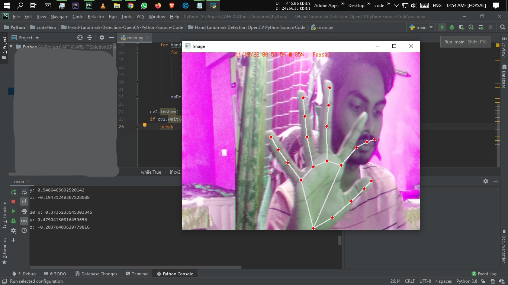

# Hand-Landmark-Detection-OpenCV-Python

# Project Name:
Hand Landmark Detection Project In Python With Source Code
# Abstract:
Hand Landmark Detection Python OpenCV is the process of finding renowned human-made sculptures, buildings, and monuments inside a picture.
# Language/s Used:
Python Deep Learning
# Python version (Recommended):	
3.8/3.9
# Database:	 
None
# Type:	
Desktop Application

Hand Landmark Detection OpenCV Python : About the project
This 2022 Hand Landmark Detection OpenCV Python was created with Python and OpenCV. With this Python Project, we’ll get hand landmarks from a webcam using Python, MediaPipe, and OpenCV.

# Example:

